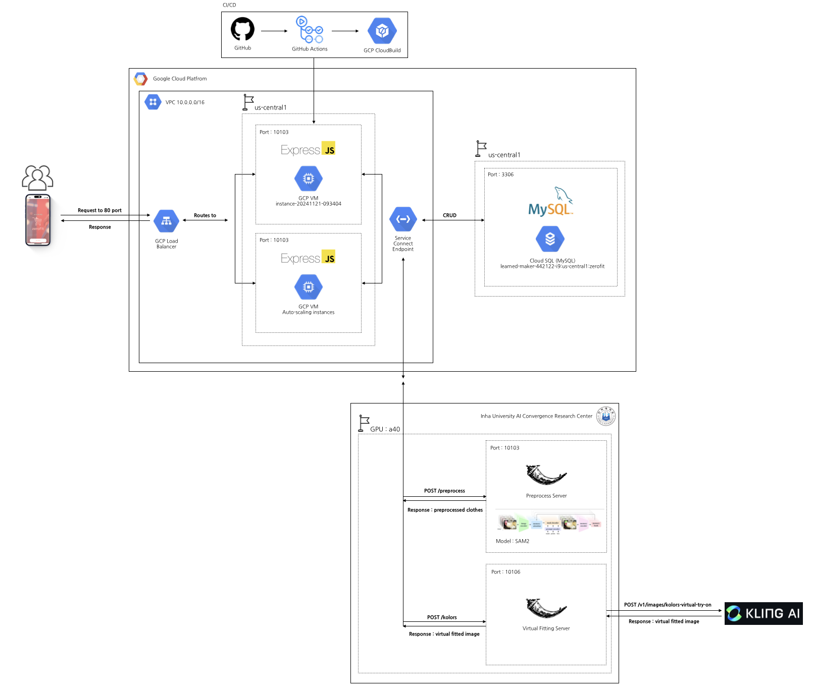

# 👚 ZEROFIT_NODEJS_SERVER
  

이 프로젝트는 **Google Cloud Platform (GCP)**과 **AI 모델(SAM2, KOLORS)**을 활용하여 나만의 옷장과 가상 피팅 서비스를 제공하는 서버입니다.  

사용자는 나만의 옷장을 통해 옷을 관리하고 의류장터에 옷을 판매하거나 구매할 수 있습니다.
사용자는 AI 기반으로 원하는 옷을 피팅하고 스타일링을 추천받을 수 있습니다.

---

## 👥 ZEROFIT Contributors

| 이름          | 역할                | GitHub 프로필                      |
|---------------|---------------------|-----------------------------------|
| 홍길동        | 팀 리더 / 기획 및 디자인 | [홍길동](https://github.com/username1) |
| 김철수        | AI       | [김철수](https://github.com/username2) |
| 이영희        | 프론트엔드    | [이영희](https://github.com/username3) |
| 국영희        | 프론트엔드    | [국영희](https://github.com/username3) |
| 박지민        | 백엔드     | [박지민](https://github.com/logicallaw) |

---
## 프로젝트 구조
ZEROFIT_NodeJS_Server/
├── .github/                 # GitHub 관련 설정 파일
├── config/                  # 설정 파일
├── controllers/             # 컨트롤러: 요청 처리 로직
├── docs/                    # 문서화 파일
├── logs/                    # 로그 파일
├── middlewares/             # 미들웨어 함수
├── migrations/              # 데이터베이스 마이그레이션 파일
├── models/                  # 데이터베이스 모델 정의
├── passport/                # Passport 인증 관련 설정
├── public/                  # 정적 파일 (이미지, CSS, JavaScript 등)
├── routes/                  # 라우트 정의
├── test/                    # 테스트 코드
├── views/                   # 뷰 템플릿
├── .dockerignore            # Docker에서 무시할 파일 목록
├── .gitignore               # Git에서 무시할 파일 목록
├── Dockerfile               # Docker 이미지 설정 파일
├── LICENSE.txt              # 라이선스 정보
├── README.md                # 프로젝트 설명서
├── app.js                   # 애플리케이션 진입점
├── cloudbuild.yaml          # Cloud Build 설정 파일
├── package-lock.json        # 종속성 잠금 파일
├── package.json             # 프로젝트 메타데이터 및 종속성 목록
└── server.js                # 서버 설정 및 실행 파일

## ⚙️ 기술 스택

- **Backend**: Node.js, Express.js, Flask
- **Database**: Cloud SQL (MySQL)  
- **Cloud Provider**: Google Cloud Platform (GCP)  
  - GCP VM Instances (Auto-scaling)  
  - GCP Cloud Load Balancer  
  - GCP Cloud Build (CI/CD)  
- **AI Models**: SAM2, KOLORS  
- **GPU Server**: NVIDIA A40 (Inha University AI Convergence Research Center)  

---

## 🗂️ 프로젝트 아키텍처

  

1. **클라이언트 요청**  
   - 사용자가 요청을 보내면 GCP Load Balancer를 통해 Express.js 서버로 전달됩니다.

2. **GCP Express.js 서버**  
   - Express.js 서버는 CRUD 요청을 MySQL Cloud SQL로 전송합니다.  
   - 이미지 처리 요청은 GPU 서버로 전달됩니다.

3. **학교 Flask 서버**  
   - Flask 전처리 서버에서 SAM2 모델을 사용해 전처리된 의류 데이터를 생성합니다.  
   - Flask 가상 피팅 서버는 Express.js에 의한 요청으로 KlingAI 서버로 api 요청을 보내고 응답으로 최종 가상 착용 이미지를 반환합니다. 해당 이미지는 GCP Node.js 서버로 전송되어 저장하고 관리되며 Flutter로 해당 이미지를 반환합니다.

※  **GCP Load Balancer란?**  
   - 로드밸런서란 클라이언트로부터 들어오는 요청을 여러 서버(인스턴스)로 분산시켜주는 시스템을 말합니다.
   - 현재 저희 서버는 백엔드 인스턴스의 사용률이 80% 넘지 않도록 설정되어 있습니다.
   - 만약, 백엔드 인스턴스 사용률이 80%를 초과하게 된다면 GCP의 오토스케일링이 새로운 서버(인스턴스)를 자동으로 생성하게 됩니다.

---

## 🚀 시작하기

### 1. 요구사항

아래 소프트웨어 및 도구가 필요합니다:

- **Node.js** (v23.1.0 이상 권장)
- **npm** (v10.9.0 이상 권장)
- **MySQL 데이터베이스**  
- **Google Cloud 계정** 및 설정된 프로젝트  
- **PM2** (서버 프로세스 관리용)

### 2. 설치

#### **로컬 환경 실행**

1. **레포지토리 클론**
   ```bash
   git clone https://github.com/your-username/ZEROFIT_NodeJS_Server.git
   cd ZEROFIT_NodeJS_Server
2. **의존성 설치**
   ```bash
   npm install
3. **환경 변수 설정**
   ```bash
   COOKIE_SECRET = your-cookie-secret

   # Connect to GCP MySQL - PROD
   SEQUELIZE_USERNAME = your-db-username
   SEQUELIZE_PASSWORD = your-db-password
   SEQUELIZE_DB_PROD = your-db-name

   SEQUELIZE_HOST = your-cloud-sql-host
   SEQUELIZE_PORT = your-cloud-sql-port

   # Connect to local MySQL - DEV
   SEQUELIZE_DEV_USERNAME = your-db-username
   SEQUELIZE_DEV_PASSWORD = your-db-password
   SEQUELIZE_DEV_DB = your-db-name

   SEQUELIZE_DEV_HOST = your-cloud-sql-host
   SEQUELIZE_DEV_PORT = your-cloud-sql-port

   # Connect to local MySQL - TEST 
   SEQUELIZE_TEST_USERNAME = your-db-username
   SEQUELIZE_TEST_PASSWORD = your-db-password
   SEQUELIZE_TEST_DB = your-db-name

   SEQUELIZE_TEST_HOST =  your-cloud-sql-host
   SEQUELIZE_TEST_PORT = your-cloud-sql-port
   TEST_SERVER_URL = your-cloud-sql-url

   # FLASK SAM
   FLASK_SAM_HOST = your-flask-sam-host
   FLASK_SAM_PORT = your-flask-sam-port

   # FLASK KOLORS
   FLASK_KOLORS_HOST = your-flask-kolors-host
   FLASK_KOLORS_PORT = your-flask-kolors-port

   # JWT SECRET
   JWT_SECRET = your-jwt-secret
   JWT_EXPIRES_IN= your-jwt-expires-in
   ```
4. **서버 실행**
   ```bash
   npm run prod
   ```
5. **PM2 프로세스 관리**
   ```bash
   npx pm2 monit
   ```
## 📡 API 사용법

### **전처리 요청 (Preprocess)**

1. **Endpoint: POST /preprocess**
   설명: 이미지 전처리 요청을 보내 SAM2 모델이 옷 데이터를 생성합니다.
   ```bash
   {
    "image_url": "https://example.com/image.jpg"
   }
   ```
   ```bash
   {
    "status": "success",
    "preprocessed_image": "https://example.com/preprocessed-image.jpg"
   }
   ```
   
### **가상피팅 요청 (Virtual Try-On)**

1. **Endpoint: POST /virtual-try-on**
   설명: 사용자의 이미지를 가상으로 피팅한 결과를 반환합니다.
   ```bash
   {
    "user_image_url": "https://example.com/user.jpg",
    "clothes_image_url": "https://example.com/clothes.jpg"
   }
   ```
   ```bash
   {
    "status": "success",
    "virtual_fitted_image": "https://example.com/virtual-fitted.jpg"
   }
   ```

## 🛠️ CI/CD 파이프라인

### **GCP Cloud Build & GitHub Actions**
코드가 GitHub에 푸시되면 Cloud Build가 자동으로 서버를 빌드하고 배포합니다.

## 🧑‍💻 기여 방법

1. **이 레포지토리를 Fork하세요.**
2. **새 브랜치를 생성하세요.**
   ```bash
   git checkout -b feature/새기능
   ```
3. **변경 사항을 커밋하세요.**
   ```bash
   git commit -m "Add 새 기능"
   ```
4. **브랜치를 푸시하세요.**
   ```bash
   git push origin feature/새기능
   ```
5. **Pull Request를 생성하세요.**

## 📄 라이센스
이 프로젝트는 MIT License를 따릅니다.

## 📝 문의
궁금한 사항이 있으면 Issues에 등록하거나 아래 연락처로 문의 부탁드립니다.
 - Email: logicallawbio@gmail.com
 - GitHub: logicallaw